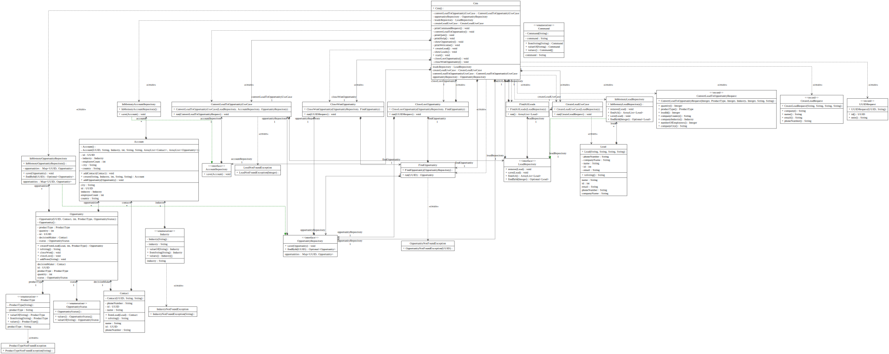

# CRM Project

## Clase CRM
Creamos un Scanner para después leer al usuario tanto para navegar por el menú como para crear leads, etc.

Declaramos 6 variables `(CreateLeadUseCase, ConvertLeadToOpportunityUseCase, FindAllLeads, FindOpportunity, CloseLostOpportunity, CloseWonOpportunity)`que son clases específicas para cada una de esas funciones que desarrollará la app.
Fijarse que las dos primeras se llaman “UseCase”, veremos después otras clases llamadas “Request” que son las que le pasarán a estas “UseCase” la información.

### Constructor
En el constructor inicializamos tres objetos que nos sirven de repositorio.`(LeadRepository,AccountRepository y OpportunityRepository)`
Son interfaces con los métodos (guardar, borrar y buscar), cada una de ellas con su Clase pareja “InMemory” que es donde está el código para estos métodos (guardar, borrar y buscar) y los HashMap para  para guardar la información de leads, accounts y opportunities.

También inicializamos las 6 variables antes comentadas, utilizan como argumentos de sus constructores los repositorios creados antes. Las 2 últimas también utilizan como argumento de su constructor la propia variable findOpportunity.

### Menú
Diferentes clases para crear el menú y leer la entrada del usuario y poder navegar por él ejecutando el código que quiere el usuario.

En el método `createLead()` sucede lo que se comentaba antes, primero se lee la entrada del usuario de este nuevo lead y se almacena en la variable request. Después se utiliza el método run() de createLeadUseCase con esta variable request, tanto para crear el lead como para guardarlo en el repositorio ya que es el mismo repositorio el que hay en el método run como el que se creó al comienzo de este crm.

En el método `convertLeadToOpportunity()` sucede lo mismo, se utiliza una request para ejecutar el método run() de convertLeadToOpportunityUseCase. Se pregunta al usuario por interest y por industry, su respuesta se compara con los valores de los enum ProductType e Industry, si corresponde se da valor a ProductType/Industry y se sale del while, y si no se lanza una excepción y se vuelve a preguntar.

Cuando ya tenemos todos los datos de la request, se ejecuta el método run() de convertLeadToOpportunityUseCase con esta request y se convierte el lead sí existía con la ID proporcionada o se lanza una excepción si este no existe.

En `showLeads()` se muestran en pantalla los leads obtenidos por el método run() de la clase findAllLeads, donde se ejecuta findAll(), método propio de los HashMap como son nuestros repositorios.

En `showOpportunity()` es parecido a lo anterior, pero el método utilizado para obtener la opportunity del HashMap es get(id).

En `closeLostOpportunity()` preguntamos al usuario por la id de la opportunity que quiere cerrar y por una nota para llevar un registro de lo que se hace en el programa, de esta manera se pueden seguir los contactos realizados con cada opportunity. Estos dos datos, (id, nota) sirven para crear un objeto UUIDRequest, que nos sirve de manera similar a lo anterior como objeto accesorio para realizar la consulta en el repositorio a partir de su id.

`closeWonOpportunity()` es igual que el anterior pero cambia el estado a Won y el anterior método a Lost.

## Class diagram

